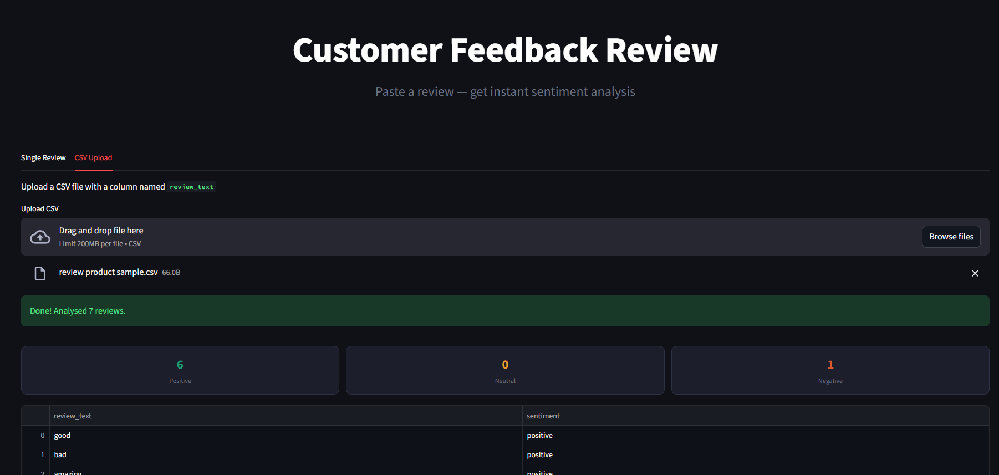
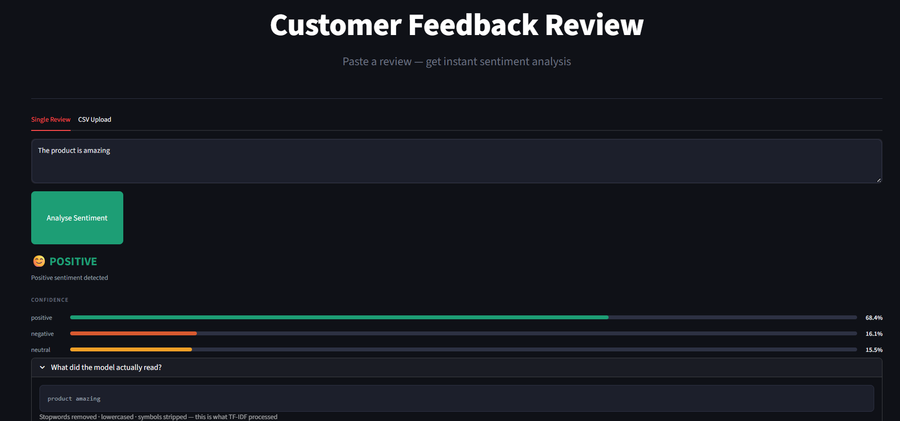
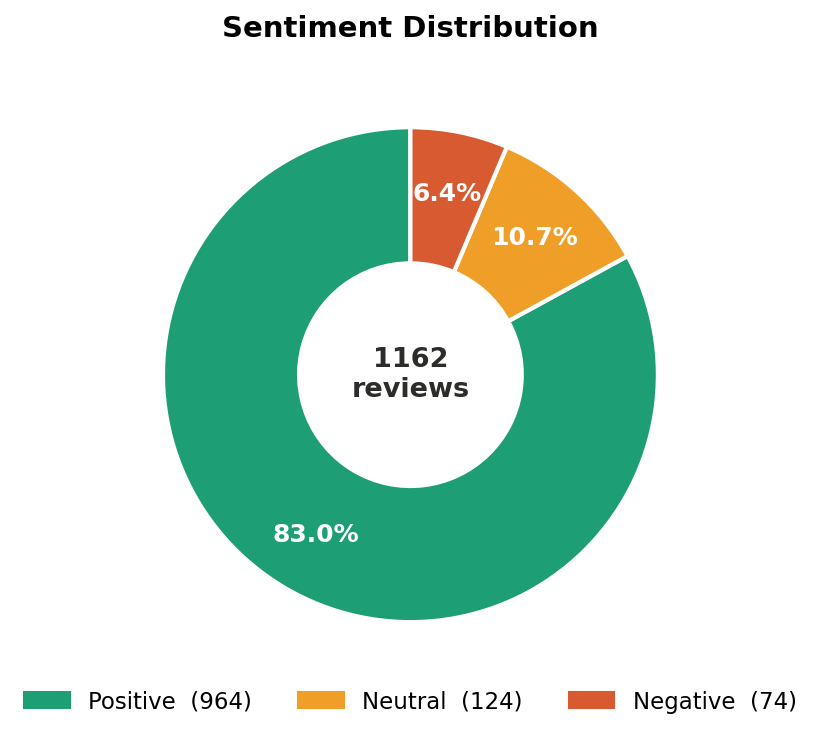
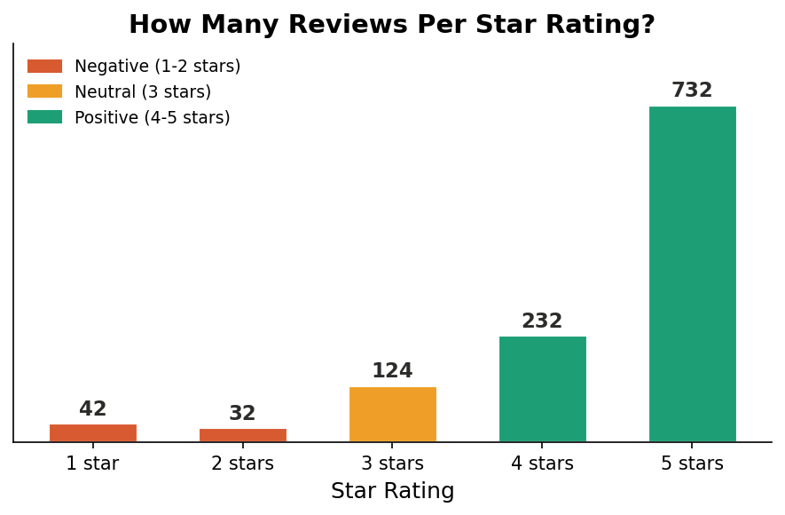
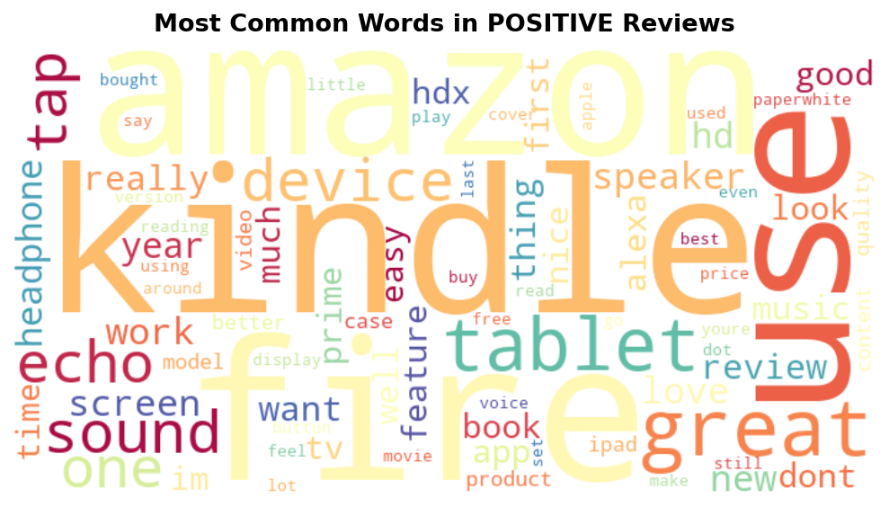
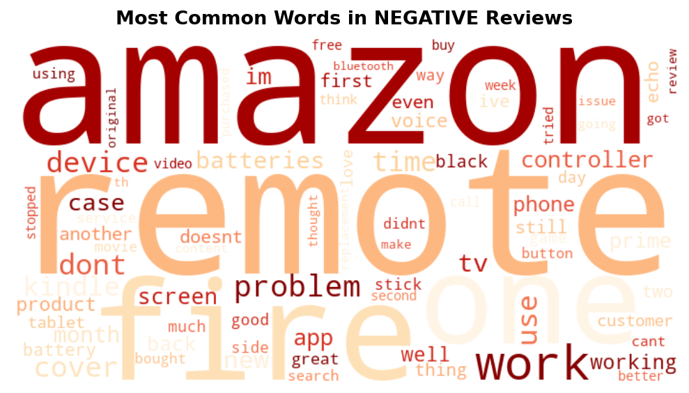
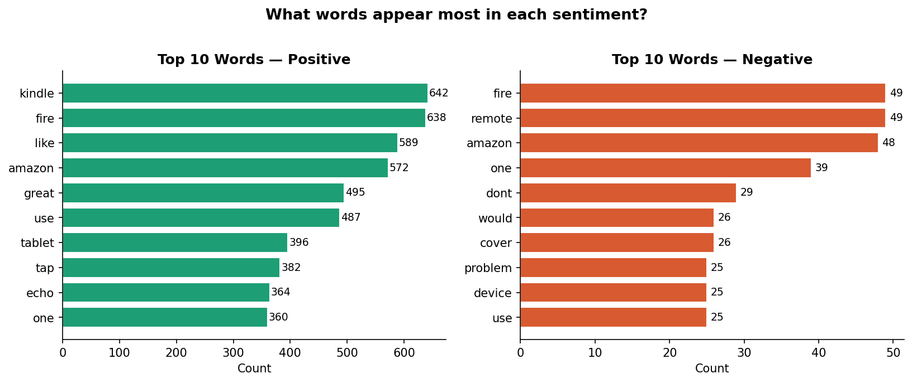
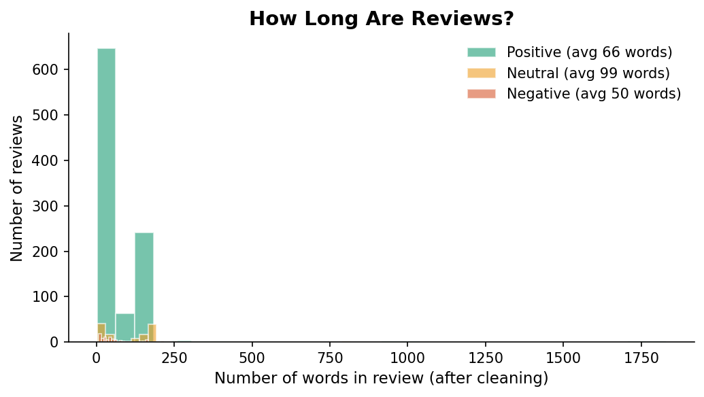
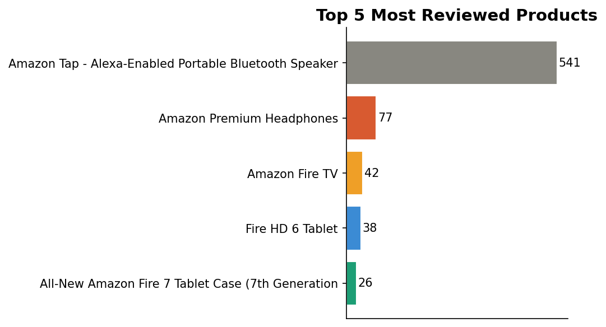

# Customer Feedback Intelligence System

> Xploro Machine Learning Internship 

An AI-powered sentiment analysis web application that uses NLP and Machine Learning to classify customer reviews into Positive, Neutral, and Negative sentiments through an interactive Streamlit dashboard.

---
## Features

- Sentiment Classification (Positive, Neutral, Negative)
- Interactive Streamlit Dashboard
- TF-IDF Feature Engineering
- Linear SVM Machine Learning Model
- Topic Modeling using LDA
- Data Visualization and EDA
- Real-time Customer Review Analysis

---

## Demo Screenshots

<br><br>



---

## Project Pipeline

```
Raw Data (1,597 reviews)
     ↓
Data Cleaning      → remove symbols, URLs, stopwords
     ↓
EDA                → 7 charts exploring the data
     ↓
TF-IDF             → convert words into 5,000 number features
     ↓
ML Model           → train 3 models, pick best (Linear SVM)
     ↓
Theme Extraction   → LDA finds 5 hidden product topics
     ↓
Streamlit App      → live web UI for predictions
```

---
## Exploratory Data Analysis (EDA) Charts









---

## Results

| Model | Test Accuracy | CV Accuracy |
|---|---|---|
| Logistic Regression | 94.1% | 90.0% |
| Naive Bayes | 88.2% | 85.4% |
| **Linear SVM** | **97.5%** | **96.4%** |

### Discovered Themes (LDA)
| Theme | Top Keywords |
|---|---|
| Headphones & Audio | sound, headphones, bass, music |
| Kindle & Reading | kindle, screen, read, paperwhite |
| Fire TV & Streaming | fire, tv, prime, roku |
| Fire Tablet & Devices | tablet, hdx, ipad, device |
| Echo & Alexa | alexa, echo, speaker, tap |

---

## How To Run

### 1. Install libraries
```bash
pip install -r requirements.txt
```

### 2. Run notebooks in order (in Jupyter)
```
1. Data_Cleaning.ipynb
2. EDA_Process.ipynb
3. ML model.ipynb
4. Theme_extraction.ipynb
```

### 3. Launch the app
```bash
streamlit run app.py
```
Open `http://localhost:8501` in your browser.

---

## File Structure

```
xploro_project/
│
├── app.py                        # Streamlit web application
├── README.md                     # Project documentation
├── requirements.txt              # Required Python libraries
│
├── assets/
│   ├── image.png                 # App screenshot
│   └── image-1.png               # Results screenshot
│
├── dataset/
│   ├── review.csv                # Raw dataset
│   ├── cleaned_reviews.csv       # Cleaned dataset
│   ├── final_reviews.csv         # Dataset with theme labels
│   └── sample csv.csv            # Sample input file
│
├── preprocess/
│   ├── Data_Cleaning.ipynb       # Data cleaning & preprocessing
│   └── EDA_Process.ipynb         # Exploratory data analysis
│
├── models/
│   ├── ML model.ipynb            # Model training notebook
│   ├── Theme_extraction.ipynb    # LDA topic modelling notebook
│   ├── model.pkl                 # Trained Linear SVM model
│   ├── tfidf.pkl                 # TF-IDF vectorizer
│   ├── lda_model.pkl             # Trained LDA model
│   └── lda_dict.pkl              # LDA dictionary
│
└── charts/
    ├── chart1_sentiment.png
    ├── chart2_ratings.png
    ├── chart3_wordcloud_positive.png
    ├── chart4_wordcloud_negative.png
    ├── chart5_topwords.png
    ├── chart6_length.png
    ├── chart7_products.png
    ├── chartA_model_compare.png
    ├── chartB_confusion.png
    ├── chartC_tfidf_features.png
    ├── chartD_predictions.png
    ├── chartE_themes.png
    ├── chartF_theme_keywords.png
    └── chartG_theme_sentiment.png

```
---

## Key Insights

- **83% of reviews are positive** — Amazon products get mostly good feedback
- **Data was imbalanced** — handled using upsampling before model training
- **Negative reviews are longer** — unhappy customers write more (avg 78 words vs 62)
- **Top negative words**: return, slow, battery, disappointed, broken
- **Top positive words**: love, great, amazing, easy, perfect
- **Linear SVM** outperformed all other models for text classification

---

## Tech Stack

| Tool | Purpose |
|---|---|
| Python 3 | Main language |
| pandas | Data handling |
| scikit-learn | TF-IDF + ML models |
| NLTK | Text cleaning |
| Gensim | LDA topic modelling |
| Matplotlib / Seaborn | Charts |
| WordCloud | Word cloud visuals |
| Streamlit | Web app |

---

*Built during 2-week Xploro ML Internship · June 2026*
